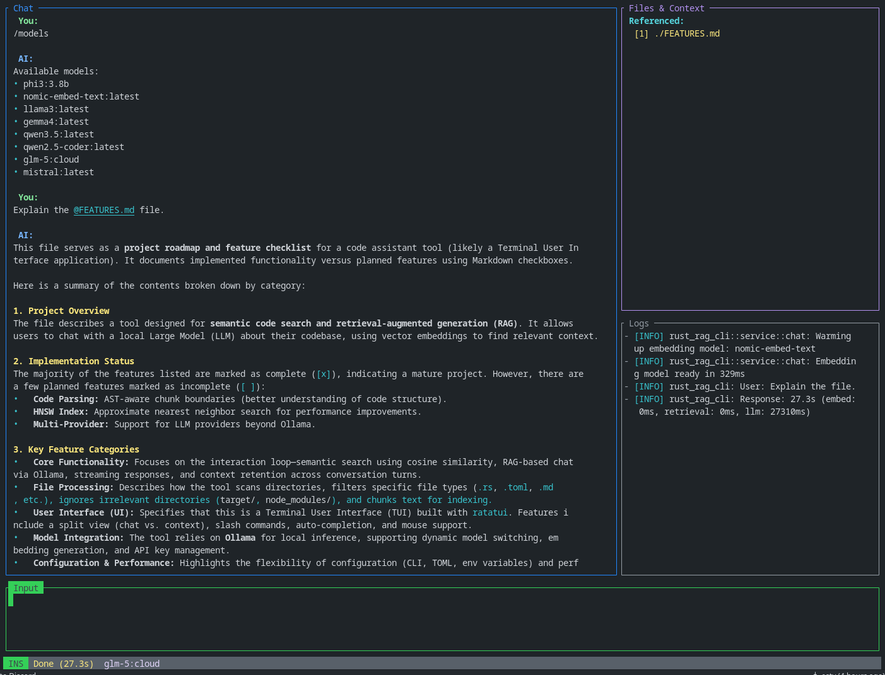

# rust-rag-cli

A local-first semantic code search and chat CLI using RAG (Retrieval-Augmented Generation) with Ollama.

[](LICENSE)

## Architecture

```
┌─────────────────────────────────────────────────────────────┐
│                     User Interface (ratatui)                │
│  ┌──────────────────────┐  ┌──────────────────────────────┐ │
│  │   Chat Panel         │  │   Context Panel              │ │
│  │   (Messages/Draft)   │  │   (Retrieved Code Chunks)    │ │
│  └──────────────────────┘  └──────────────────────────────┘ │
│  ┌─────────────────────────────────────────────────────┐    │
│  │  Logs Panel (User prompts, timing, errors)          │    │
│  └─────────────────────────────────────────────────────┘    │
│  ┌─────────────────────────────────────────────────────┐    │
│  │  Input Bar (Commands / Messages)                    │    │
│  └─────────────────────────────────────────────────────┘    │
└─────────────────────────────────────────────────────────────┘
                            │
                            ▼
┌─────────────────────────────────────────────────────────────┐
│                    App State (Arc<Mutex<App>>)              │
│  ├─ messages: Vec<Message>                                  │
│  ├─ input: String                                           │
│  ├─ file_references: Vec<FileReference>                     │
│  ├─ indexing_progress: Option<IndexingProgress>             │
│  ├─ streaming_message: Option<String>                       │
│  └─ follow_bottom: bool (auto-scroll)                       │
└─────────────────────────────────────────────────────────────┘
                            │
                            ▼
┌─────────────────────────────────────────────────────────────┐
│                   ChatService (Arc<Mutex<>>)                │
│  ├─ client: OllamaClient                                    │
│  ├─ config: Config (models, base_url)                       │
│  └─ index: Arc<Mutex<SemanticIndex>>                        │
│      └─ chunks: Vec<CodeChunk>                              │
│          ├─ file_path: String                               │
│          ├─ content: String                                 │
│          └─ embedding: Vec<f32>                             │
└─────────────────────────────────────────────────────────────┘
                            │
                            ▼
┌─────────────────────────────────────────────────────────────┐
│                   Ollama API (HTTP)                         │
│  ├─ /api/embeddings  - Get embeddings                       │
│  ├─ /api/generate    - Chat completion (streaming)          │
│  └─ /api/tags        - List available models                │
└─────────────────────────────────────────────────────────────┘
```

## Query Flow

```
User Input                                  LLM Response
    │                                             ▲
    │  1. Parse @file references                  │
    │  2. Load file contents                      │
    ▼                                             │
┌─────────────────────────────────────┐           │
│         ChatService                 │           │
│  ┌──────────────────────────────┐   │           │
│  │ query(prompt)                │   │           │
│  │ ├─ Get embedding from Ollama │   │           │
│  │ └─ cosine_similarity()       │   │           │
│  └──────────────────────────────┘   │           │
│             │                       │           │
│             ▼                       │           │
│  ┌─────────────────────────────┐    │           │
│  │ retrieve_context(top_k=5)   │    │           │
│  │ └─ Score and sort chunks    │    │           │
│  └─────────────────────────────┘    │           │
│             │                       │           │
│             ▼                       │           │
│  ┌─────────────────────────────┐    │           │
│  │ build_prompt_with_refs()    │    │           │
│  │ ├─ File references          │    │           │
│  │ ├─ Retrieved context        │    │           │
│  │ └─ User question            │    │           │
│  └─────────────────────────────┘    │           │
└─────────────────────────────────────┘           │
             │                                    │
             └────────────────────────────────────┘
                        ask_question_streaming()
```

## Features

### Core Functionality
- **SEMANTIC SEARCH** - Cosine similarity-based code retrieval using embeddings
- **RAG CHAT** - Context-aware chat with local LLM via Ollama
- **FILE REFERENCES** - Include files/directories in prompts with `@path` syntax
- **STREAMING RESPONSES** - Real-time response streaming from LLM
- **INDEXING** - Automatic chunking and embedding of code files
- **PERSISTENCE** - Save/load semantic index to JSON file
- **CONVERSATION HISTORY** - Multi-turn conversation context retention
- **FOLLOW-UP QUESTIONS** - Automatic follow-up detection and context reuse

### User Interface
- **TUI INTERFACE** - Beautiful terminal UI with ratatui
- **SPLIT VIEW** - Chat panel and context panel side-by-side
- **LOGS PANEL** - Real-time logging with timing metrics
- **COMMAND INPUT** - Slash commands for configuration and actions
- **AUTO-COMPLETION** - Tab completion for commands and @file paths
- **MODEL SELECTION** - Switch between available Ollama models
- **STATUS BAR** - Real-time status and progress indicators
- **MOUSE SUPPORT** - Scroll through chat history with mouse wheel
- **AUTO-SCROLL** - Auto-follows new messages, scroll up to view history
- **MARKDOWN RENDERING** - Rich formatting for responses:
  - Headers (`#`, `##`, `###`)
  - Bold (`**text**`)
  - Italic (`*text*`)
  - Code (`` `code` ``)
  - Lists (`- item`, `1. item`)
  - File references (`@file`)

### File Processing
- **DIRECTORY SCANNING** - Recursive file discovery with ignore patterns
- **FILE FILTERING** - Support for .rs, .toml, .json, .yaml, .md, .py, .js, .go, and more
- **IGNORE DIRECTORIES** - Skips models/, node_modules/, target/, dist/, .git/
- **TEXT CHUNKING** - Configurable chunk size and overlap
- **FILE WATCHING** - Auto-reindex on file changes (planned)
- **INCREMENTAL INDEXING** - Update index for changed files only

### Indexing & Search
- **COSINE SIMILARITY** - Vector similarity scoring for retrieval
- **TOP-K RETRIEVAL** - Configurable number of context chunks
- **STREAMING INDEX** - Progressive indexing with progress display
- **INDEX SAVE/LOAD** - Persist index to avoid re-indexing
- **THRESHOLD FILTERING** - Relevance-based chunk filtering
- **METADATA STORE** - Track file modification times for incremental updates

### Model Integration
- **OLLAMA CLIENT** - HTTP client for local LLM inference
- **EMBEDDING API** - Generate embeddings via Ollama API
- **CHAT API** - Query LLM with context-augmented prompts
- **MODEL LISTING** - Discover available Ollama models
- **MODEL SWITCHING** - Runtime model selection for chat and embed
- **API KEY MANAGEMENT** - Secure storage for remote API keys (planned)

### Configuration
- **CLI ARGUMENTS** - Command-line arguments for path and index file
- **DEFAULT MODELS** - Configurable chat and embed model defaults
- **BASE URL** - Configurable Ollama server endpoint
- **CONFIG FILES** - TOML/YAML configuration files
- **ENV VARIABLES** - Environment-based configuration
- **PROFILES** - Multiple configuration profiles

### Performance & UX
- **ASYNC RUNTIME** - Tokio-based async operations
- **PROGRESS INDICATORS** - Real-time indexing progress
- **LOADING STATES** - Visual feedback during operations
- **CLIPBOARD SUPPORT** - Copy selected text to clipboard
- **CACHING** - Cache embeddings for repeated queries
- **BACKGROUND INDEXING** - Non-blocking index operations
- **RATE LIMITING** - Throttle API requests

### Developer Tools
- **DEBUG MODE** - Verbose logging and diagnostics
- **EXPORT CONTEXT** - Save retrieved context to file
- **IMPORT QUESTIONS** - Load questions from file
- **BENCHMARK MODE** - Performance metrics collection

## Quick Start

```bash
# Build and run
cargo run -- chat

# Run with specific project path
cargo run -- chat --path /path/to/project

# Run with custom index file
cargo run -- chat --index-file .my-index.json

# Force re-index
cargo run -- chat --reindex

# Index without starting chat
cargo run -- index /path/to/project
```

### Prerequisites

1. Install [Ollama](https://ollama.com/)
2. Pull required models:
   ```bash
   ollama pull llama3
   ollama pull nomic-embed-text
   ```

### Two Modes

**1. Chat Mode (Default)**
```bash
cargo run -- chat
# Starts interactive TUI
# Auto-indexes if no index found
```

**2. Index-Only Mode**
```bash
cargo run -- index /path/to/project
# Creates index file
# Use with --index-file flag
```

## Commands

| Command | Description | Example |
|---------|-------------|---------|
| `/models` | List available Ollama models | `/models` |
| `/switch <model>` | Change chat model | `/switch llama3` |
| `/switch-embed <model>` | Change embed model | `/switch-embed nomic-embed-text` |
| `/index [path]` | Index a directory | `/index ./src` |
| `/incremental-index [path]` | Index only changed files | `/incremental-index ./src` |
| `/reindex` | Re-index current project | `/reindex` |
| `/save` | Save current index | `/save` |
| `/clear` | Clear chat history | `/clear` |
| `/clear-history` | Clear conversation context | `/clear-history` |
| `/profiles` | List available profiles | `/profiles` |
| `/profile <name>` | Switch configuration profile | `/profile work` |
| `/syntax` | Toggle syntax highlighting | `/syntax` |
| `/benchmark` | Show timing metrics | `/benchmark` |
| `/help` | Show help text | `/help` or `/h` or `?` |
| `/quit` | Exit application | `/quit` or `/q` |

### File References

Include specific files or directories in your questions:

```
@src/main.rs How does the event loop work?
@src/db/ Explain the database schema
@README.md What is this project about?
```

Include multiple files:
```
@src/client.rs @src/service/chat.rs How do these modules interact?
```

## Keyboard Shortcuts

| Key | Action |
|-----|--------|
| `Enter` | Send message or execute command |
| `Tab` | Accept auto-completion or next suggestion |
| `Shift+Tab` | Previous suggestion |
| `Esc` | Cancel suggestions or streaming |
| `←/→` | Move cursor |
| `Backspace` | Delete character before cursor |
| `Delete` | Delete character at cursor |
| `Home` | Move cursor to start |
| `PageUp` / `k` | Scroll chat up |
| `PageDown` / `j` | Scroll chat down |
| `Ctrl+C` / `Ctrl+D` / `Ctrl+Q` | Quit |

### Mouse Support

- **Scroll wheel** - Scroll through chat history
- **Click and drag** - Select text for copy to clipboard

## Modules

| Module | Description |
|--------|-------------|
| `main.rs` | Application entry point, event loop, TUI setup |
| `cli.rs` | Command-line argument parsing |
| `app/command.rs` | Command parsing and dispatch |
| `app/state.rs` | Application state (messages, input, progress) |
| `app/action.rs` | State reduction actions |
| `service/chat.rs` | RAG service (index, retrieve, chat) |
| `service/mod.rs` | Service configuration |
| `clients/ollama.rs` | Ollama HTTP client (embeddings, chat, models) |
| `client.rs` | HTTP request/response types |
| `db/store.rs` | Semantic index (chunks, save/load) |
| `db/metadata.rs` | File metadata for incremental indexing |
| `scrapper.rs` | Directory scanning and text chunking |
| `input/handler.rs` | Keyboard input handling |
| `ui/render.rs` | TUI rendering with ratatui |
| `ui/syntax.rs` | Code syntax highlighting |
| `config/settings.rs` | Configuration management |
| `config/mod.rs` | Config loading and profiles |
| `dev/debug.rs` | Debug logging utilities |
| `dev/benchmark.rs` | Performance metrics |
| `secrets/store.rs` | Secure API key storage |
| `watcher/handler.rs` | File watching (planned) |

## Data Model

```rust
struct CodeChunk {
    file_path: String,
    content: String,
    embedding: Vec<f32>,  // Vector embedding from Ollama
}

struct SemanticIndex {
    chunks: Vec<CodeChunk>,
}

struct FileReference {
    path: PathBuf,
    content: Option<String>,  // Loaded file/directory content
}

struct Message {
    source: MessageSource,  // User, Assistant, System
    content: String,
}

struct App {
    messages: Vec<Message>,
    input: String,
    streaming_message: Option<String>,
    file_references: Vec<FileReference>,
    indexing_progress: Option<IndexingProgress>,
    current_model: String,
    current_embed_model: String,
    available_models: Vec<String>,
    suggestions: Vec<String>,
    follow_bottom: bool,  // Auto-scroll state
    // ...
}
```

## Indexing Strategy

1. **Directory Scan**
   - Recursively find files in target directory
   - Skip ignored directories (models/, node_modules/, target/, dist/, .git/)
   - Filter by extension

2. **Text Chunking**
   - Split files into overlapping line-based chunks
   - Default: 50 lines per chunk, 10 line overlap
   - Preserves code context across chunk boundaries

3. **Embedding Generation**
   - Send each chunk to Ollama embedding API
   - Store chunk + embedding + file path
   - Streaming progress updates

4. **Persistence**
   - Save index as JSON file
   - Load on startup to avoid re-indexing

## Retrieval Algorithm

```rust
fn retrieve_context(query: &str, top_k: usize) -> Vec<CodeChunk> {
    // 1. Embed the query
    let query_embedding = ollama.get_embedding(query);

    // 2. Score chunks by cosine similarity
    let mut scored: Vec<_> = index.chunks.iter()
        .map(|chunk| {
            let score = cosine_similarity(&query_embedding, &chunk.embedding);
            (score, chunk.clone())
        })
        .collect();

    // 3. Sort by score descending
    scored.sort_by(|a, b| b.0.partial_cmp(&a.0).unwrap());

    // 4. Return top-k chunks
    scored.into_iter().take(top_k).map(|(_, chunk)| chunk).collect()
}
```

## Prompt Construction

```
[Referenced files (if any @path)]

[Related context from codebase]
--- src/file1.rs ---
[chunk content]

--- src/file2.rs ---
[chunk content]

Question: [user question]
```

## Examples

### Basic Chat



## Project Structure

```
src/
├── main.rs                 # Entry point, event loop
├── cli.rs                  # CLI argument parsing
├── client.rs                # HTTP request types
├── scrapper.rs             # File scanning, chunking
├── app/
│   ├── mod.rs              # App module exports
│   ├── command.rs          # /command parsing
│   ├── state.rs            # App state struct
│   └── action.rs           # State reduction
├── clients/
│   ├── mod.rs              # Client module exports
│   └── ollama.rs           # Ollama HTTP client
├── db/
│   ├── mod.rs              # DB module exports
│   ├── store.rs            # SemanticIndex storage
│   └── metadata.rs         # File metadata tracking
├── service/
│   ├── mod.rs              # Service config
│   └── chat.rs             # RAG service logic
├── config/
│   ├── mod.rs              # Config module exports
│   └── settings.rs         # Configuration structs
├── input/
│   ├── mod.rs              # Input module exports
│   └── handler.rs          # Keyboard input handler
├── ui/
│   ├── mod.rs              # UI module exports
│   ├── render.rs           # TUI rendering
│   └── syntax.rs           # Syntax highlighting
├── dev/
│   ├── mod.rs              # Dev module exports
│   ├── debug.rs            # Debug logging
│   └── benchmark.rs        # Performance metrics
├── secrets/
│   ├── mod.rs              # Secrets module exports
│   └── store.rs            # API key storage
└── watcher/
    ├── mod.rs              # Watcher module exports
    └── handler.rs          # File watching (planned)
```

## Dependencies

| Crate | Version | Usage |
|-------|---------|-------|
| `tokio` | 1 | Async runtime |
| `reqwest` | 0.11 | HTTP client for Ollama API |
| `serde` | 1.0 | Serialization |
| `serde_json` | 1.0 | JSON parsing |
| `ratatui` | 0.28 | Terminal UI |
| `crossterm` | 0.28 | Terminal manipulation |
| `clap` | 4 | CLI argument parsing |
| `arboard` | 3 | Clipboard support |
| `tokio-stream` | 0.1 | Stream utilities |
| `futures-util` | 0.3 | Stream extensions |

## Configuration

| Parameter | Default | Description |
|-----------|---------|-------------|
| Base URL | `http://localhost:11434` | Ollama server endpoint |
| Chat model | `llama3` | Default model for chat |
| Embed model | `nomic-embed-text` | Default model for embeddings |
| Index file | `.semantic-index.json` | Index persistence path |
| Top-K | 5 | Number of chunks to retrieve |
| Chunk size | 50 lines | Lines per chunk |
| Chunk overlap | 10 lines | Overlap between chunks |

## Performance

- **Indexing**: Streaming embeddings, real-time progress
- **Retrieval**: O(n) similarity search (HNSW planned)
- **UI**: Non-blocking async event loop
- **Memory**: Index stored in Arc<Mutex<SemanticIndex>>

## Roadmap

See [FEATURES.md](FEATURES.md) for planned and completed features.

- [ ] CODE PARSING - AST-aware chunk boundaries
- [ ] HNSW INDEX - Approximate nearest neighbor for faster search
- [ ] MULTI-PROVIDER - Support for multiple LLM providers
- [ ] FILE WATCHING - Auto-reindex on file changes

## License

Licensed under [MIT](LICENSE)
